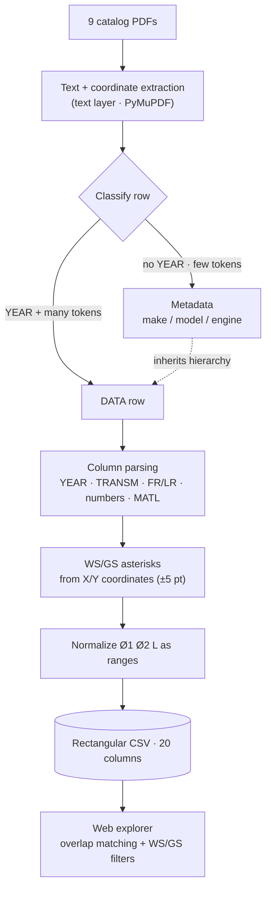

Almost all of my software projects start from a physical problem. This one is no exception.

## The context: a Mini and some healthy tinkering

I own a **2006 Mini Cooper S** - the first generation, the **R53**, the supercharged one.
I bought it with a precise idea: use it as a test bench to **experiment with its setup**
(let's keep it generic). It's a car I regularly work on - half my garage is filled with parts
I've 3D-printed for it.

Working on it, I found a **CV boot** (the rubber bellows protecting the constant-velocity
joint) badly **worn**, due for replacement. Ordinary maintenance, nothing dramatic - but with a
practical question: *which is the right part to order?* A worn boot, if neglected, eventually
fails: the grease escapes, dirt and water get in, and the joint is ruined. Better to replace it
in time, and choose it well.

## Why finding the part was the real problem

Aftermarket "universal" boots aren't chosen by car model, but by **geometry**:

- **Ø1** - small diameter (shaft side),
- **Ø2** - large diameter (joint side),
- **L** - length,
- and above all the **side**: *wheel side* or *gear side* (gearbox/differential side),
  which have different shapes and sizes.

The supplier does have this data - but inside a **PDF catalog** of 9 files, made of **multi-level
hierarchical tables** designed to be printed, not queried. Trying to answer "give me all the
*wheel-side* boots with Ø1 ~22 mm, Ø2 ~80 mm and L ~110 mm" by leafing through a PDF is exactly
the kind of work a computer should do for me.

## The idea: turn the PDF into filterable data

That's where **pdf-to-csv** came from: extract that catalog into a **rectangular CSV** and then
filter it by **size ranges**. In practice, turn an un-browsable catalog into a list of candidates.
The two halves - *generating* the CSV well and *filtering* it well - each required a couple of
non-obvious tricks.

## The procedure: from PDF to CSV (without scrambled columns)

The first "naive" attempt (split by line + keep rows with ≥15 tokens) failed badly: it lost
~40% of the rows, broke the long ones and mixed metadata with data, **shifting columns by 2-3
positions**. Queries returned 0 results.

The real problem is the **structure of the PDF**: **multi-level hierarchical tables** designed
for print. Taking it apart page by page revealed that:

- the first pages are index/intro, the **real data** starts further in;
- make / model / engine variant sit **on separate rows** (sometimes a single token: `ABARTH`, then `500`);
- some logical rows **continue on the next physical line** (when `REMARK` is long) and that
  continuation **has no year**;
- sometimes even the header is concatenated (`YEARTRANSM.`).

The procedure that works rests on two **anchors**.

**1) Anchor pattern on the year.** The YEAR field has a recognizable shape that appears **only** in
data rows, never in metadata:

```text
\d{4}\.\d{2}[-\d.]*      # e.g. 2008.08-   or   2007.07-2010.06
```

This separates data rows from metadata **deterministically** (>99% reliability).

**2) Invariant column tail.** The last columns (`Standard, Basic, Ø1, Ø2, L, MATL`) are **always**
at the end of a logical row: that's the boundary that lets you stitch broken rows back together.

At that point the algorithm is linear:

```text
1. CLASSIFY the row
   • YEAR present + many tokens   → DATA row
   • no YEAR + few tokens         → METADATA (make/model) → to INHERIT
2. PARSE the data row's columns
   • YEAR via regex · TRANSM./FR/LR via pattern · numbers (Ø, L) as floats
   • MATL as material code · inherit Record_Class from the hierarchy
3. ACCUMULATE → DataFrame → CSV   (progressive save after each PDF)
```

The most delicate part is the **WS/GS asterisks** (wheel side / gear side): the side is marked only
by a `*`, and **where** it sits matters. Instead of guessing from the text, I read it from the
**PDF text-layer coordinates** (PyMuPDF): find the X positions of the `WS`/`GS` headers, then assign
each `*` to its column by **X** and to its row by **Y** (±5 pt tolerance). Validated **58/58** on the
test page.

Result: a clean rectangular CSV (20 columns), with Ø1, Ø2 and L normalized as a `min|max` range
(keeping the original raw token too, just in case).

The full flow, from PDF to filter:



## The filtering tricks

Having the CSV is half the job; searching it "by size" takes a few precautions.

**Ranges as `min|max`.** Every dimension is an interval, not a single number. The parser also
normalizes the dirty cases: single value → `v|v`, inverted interval → reordered.

**Overlap matching, not equality.** A boot listed as `[22, 25]` must show up when I search
`[23, 24]`. The rule is the classic interval-overlap test:

```text
match  ⇔  data_min ≤ query_max   AND   query_min ≤ data_max
```

This returns all the *compatible* candidates, not just the identical ones.

**Missing data = no constraint.** If a row has an unreadable or absent dimension, I do **not**
exclude it from the filter on that dimension: otherwise I'd lose valid candidates because of a
hole in the data.

**Sliders that snap to real values.** The Ø and L sliders *snap* to the values actually present
in the dataset - no phantom thresholds that match no article.

**Explicit WS/GS filters.** I can isolate "wheel side only" or "gear side only": the side is
exactly what makes the difference when choosing the part.

**The honest limitation.** WS and GS are **independent** physical positions, with overlapping size
ranges: the side **cannot be deduced** from the numbers alone. Sometimes the outcome of an analysis
is understanding what is *not* deducible - and writing it down.

## The result

From an unsearchable PDF I got to a **filterable table** where I can narrow candidates by size and
by side in seconds - exactly what I needed to choose the boot. The tool is public and runs
**in the browser** on a data sample:

- **Live demo:** <https://carlobragetti.github.io/pdf-to-csv/>
- **Code:** <https://github.com/CarloBragetti/pdf-to-csv>
- **Project card:** [pdf-to-csv](/en/projects/pdf-to-csv/)

## The takeaway

It's the pattern I like best: a small, concrete problem (a €10 boot) becoming the excuse to build
a reusable tool. The Mini, by the way, is an inexhaustible source of projects like this one - more
will come.
